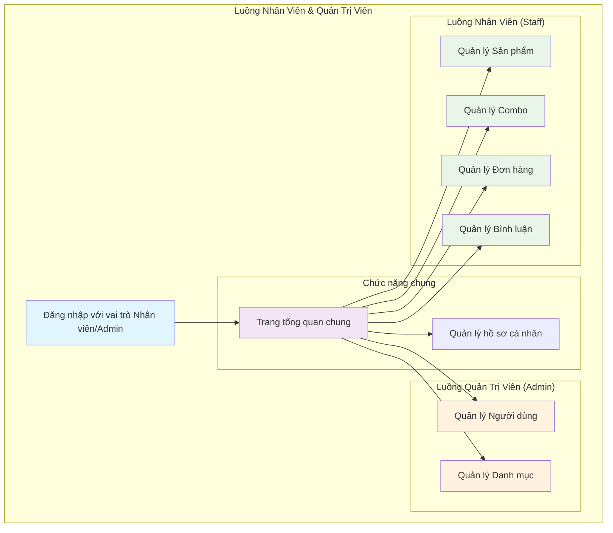
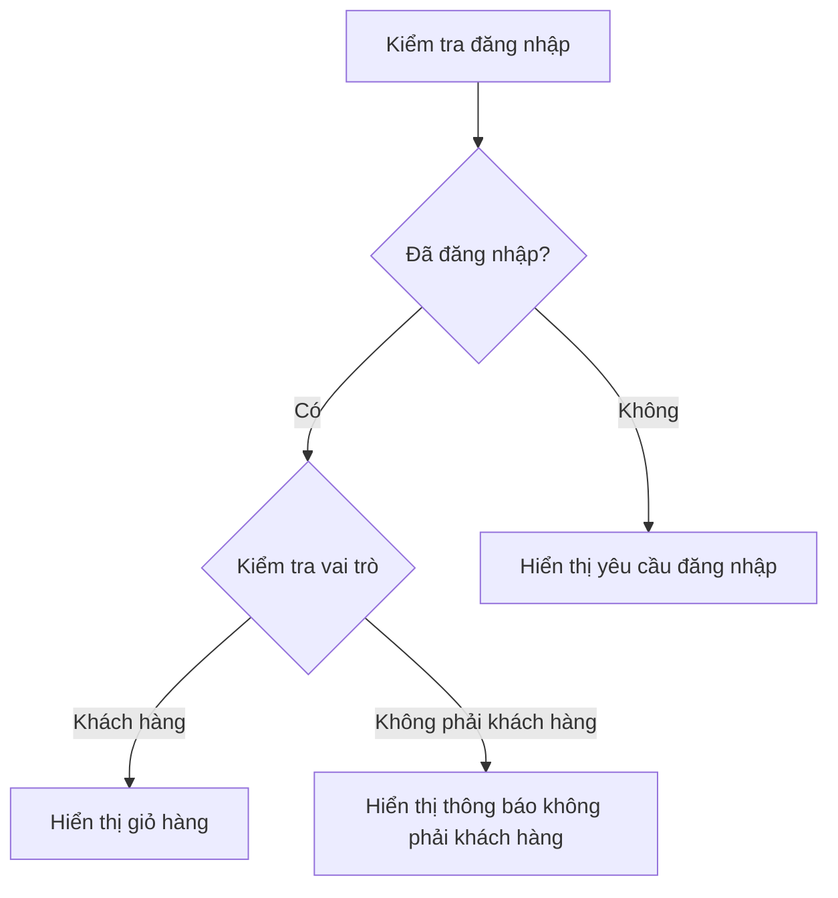
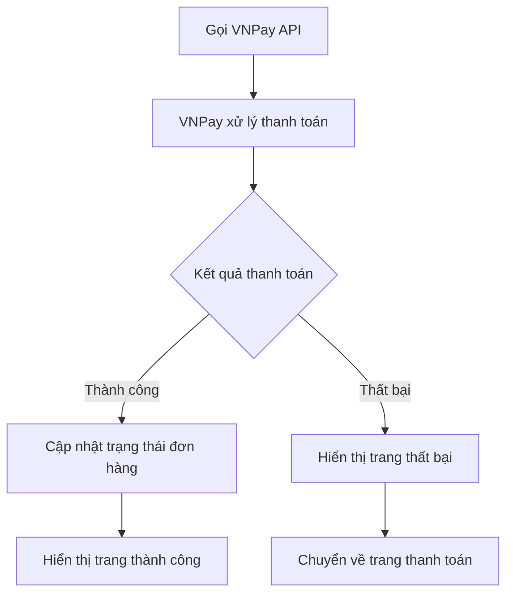

# Luồng Điều Hướng Người Dùng - B3cBonsaiWeb

## Tổng quan luồng người dùng từ đăng nhập

```mermaid
flowchart TD
    subgraph "Luồng Khách Hàng"
        A[Đăng nhập] --> B[Trang chủ]

        B --> C[Duyệt sản phẩm]
        B --> M[Xem danh mục sản phẩm]
        B --> W[Xem danh sách yêu thích]
        B --> Pofile[Quản lý hồ sơ]

        M --> C
        C --> D[Xem chi tiết sản phẩm]
        C --> N[Tìm kiếm sản phẩm]
        N --> C

        D --> E[Thêm vào giỏ hàng]
        D --> O[Xem nhanh sản phẩm]
        D --> AddWishlist[Thêm vào danh sách yêu thích]
        D --> ViewComments[Xem/Thêm bình luận]

        AddWishlist --> W
        O --> D

        E --> F[Xem giỏ hàng]
        F --> G[Chỉnh sửa giỏ hàng]
        F --> P[Xóa sản phẩm khỏi giỏ]
        F --> Q[Tăng/giảm số lượng]

        G --> H[Thanh toán]
        H --> R[Nhập thông tin giao hàng]
        H --> I[Chọn phương thức thanh toán]

        R --> I
        I --> J[VNPay Payment Gateway]
        J --> K[Kết quả thanh toán]

        K --> S[Thành công - Đơn hàng đã đặt]
        K --> T[Thất bại - Thử lại thanh toán]

        S --> U[Xem lịch sử đơn hàng]
        U --> V[Chi tiết đơn hàng]

        A --> L[Đăng ký tài khoản mới]
        L --> A
    end

    style A fill:#e1f5fe
    style B fill:#f3e5f5
    style C fill:#e8f5e8
    style D fill:#fff3e0
    style E fill:#fce4ec
    style F fill:#f1f8e9
    style H fill:#fff8e1
    style K fill:#e3f2fd
    style W fill:#ede7f6
    style Pofile fill:#ede7f6
    style ViewComments fill:#e0f7fa
```



## Luồng Nhân viên và Quản trị viên



## Chi tiết từng bước trong luồng

### 1. Đăng nhập (Authentication)
- **Controller**: Identity/Account
- **Actions**: Login, Register, ForgotPassword
- **Luồng**:
  ```
  Người dùng mới → Đăng ký → Xác nhận email → Đăng nhập
  Người dùng cũ → Đăng nhập trực tiếp
  ```

### 2. Trang chủ (Home)
- **Controller**: Customer/HomeController
- **Actions**: Index, AboutUs, ContactUs, FAQ, Terms, ReturnPolicy
- **Chức năng**:
  - Hiển thị sản phẩm mới nhất (6 sản phẩm)
  - Thông tin công ty
  - Liên hệ và hỗ trợ

### 3. Duyệt sản phẩm (Browse Products)
- **Controller**: Customer/ClientProductController
- **Actions**: Index, ListPagedProduct, SearchProducts
- **Chức năng**:
  - Hiển thị danh sách sản phẩm có phân trang
  - Bộ lọc theo: danh mục, giá, tình trạng kho, từ khóa
  - Sắp xếp theo: bán chạy, tên, giá, ngày tạo
  - Tìm kiếm sản phẩm bằng API

### 4. Chi tiết sản phẩm (Product Detail)
- **Controller**: Customer/ClientProductController
- **Actions**: Detail, QuickView, QuickViewComBo
- **Chức năng**:
  - Xem thông tin chi tiết sản phẩm hoặc combo
  - Xem hình ảnh sản phẩm
  - Đọc bình luận và đánh giá
  - Xem nhanh sản phẩm (modal popup)

### 5. Giỏ hàng (Shopping Cart)
- **Controller**: Customer/CartController
- **Actions**: Index, RightBarCart, Add, Plus, Minus, Remove, ClearCart
- **Chức năng**:
  - Thêm sản phẩm vào giỏ hàng
  - Tăng/giảm số lượng sản phẩm
  - Xóa sản phẩm khỏi giỏ hàng
  - Xóa toàn bộ giỏ hàng
  - Hiển thị giỏ hàng ở sidebar

### 6. Thanh toán (Checkout)
- **Controller**: Customer/CheckoutController, Customer/PaymentController
- **Actions**: PaymentCallBack (VNPay)
- **Luồng thanh toán**:
  ```
  Giỏ hàng → Thông tin giao hàng → Chọn phương thức thanh toán
  → VNPay Gateway → Kết quả thanh toán
  ```

## Các trạng thái và điều kiện

### Điều kiện hiển thị giỏ hàng:


### Xử lý thanh toán:


## Các API endpoints chính

| Method | Endpoint | Mô tả |
|--------|----------|-------|
| GET | `/api/products?q=` | Tìm kiếm sản phẩm |
| GET | `/Customer/Home/Index` | Trang chủ |
| GET | `/Customer/ClientProduct/ListPagedProduct` | Danh sách sản phẩm phân trang |
| GET | `/Customer/ClientProduct/Detail/{id}` | Chi tiết sản phẩm |
| POST | `/Customer/Cart/Add` | Thêm vào giỏ hàng |
| POST | `/Customer/Cart/Remove` | Xóa khỏi giỏ hàng |
| GET | `/Customer/Payment/PaymentCallBack` | Callback thanh toán VNPay |

## Các View Components

- **CategoryShopViewComponent**: Hiển thị danh mục sản phẩm
- **ComboViewComponent**: Hiển thị combo sản phẩm
- **PopularProductsViewComponent**: Sản phẩm phổ biến
- **LeftBarFilterViewComponent**: Bộ lọc sản phẩm bên trái
- **AccountProfileViewComponent**: Thông tin tài khoản
- **CommonLayoutViewComponent**: Layout chung

## Các dịch vụ bên thứ ba

- **VNPay**: Thanh toán online
- **Cloudinary**: Lưu trữ hình ảnh (tùy chọn)
- **Telegram Bot**: Thông báo
- **Email Service**: Gửi email xác nhận

## Lưu ý bảo mật

- Kiểm tra vai trò người dùng trước khi cho phép thêm vào giỏ hàng
- Validate dữ liệu đầu vào khi thanh toán
- Sử dụng HTTPS cho tất cả các giao dịch
- Session timeout: 30 phút
- Anti-forgery token cho các form

---

*Được tạo tự động từ việc phân tích mã nguồn dự án B3cBonsaiWeb*